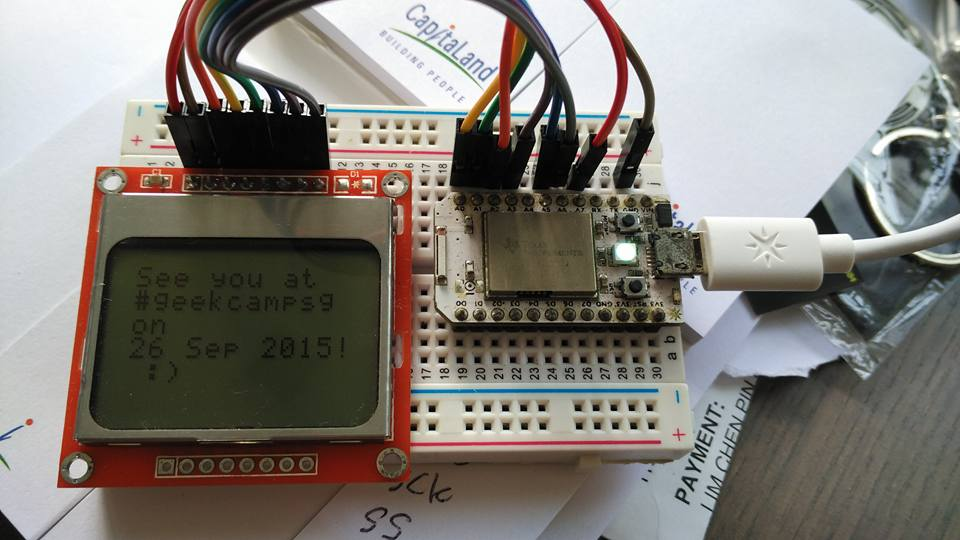

## Particle powered Nokia LCD!



```text
Short term goal is to display the PSI level in Singapore as we experience haze!
```


This is a fun desk project for me to tinker with whenever I have the time to. The library is originally from Sparkfun and is modified to have :cloud: functions to change the led brightness or update the message displayed.

The screen is initialized upon bootup while Wifi connection is established. Wifi connection is managed via code to restart the Wifi module should connection fail after 10 re-try attempts!

### Hardware Components

- [Photon (actually usually a Spark core but..)](https://store.particle.io/?product=particle-photon)
- [Nokia LCD](https://www.sparkfun.com/products/10168)

### Resources

- [PSI dataset](https://www.nea.gov.sg/api)
- [Web Interface by @suda](suda.github.io/particle-web-interface)
